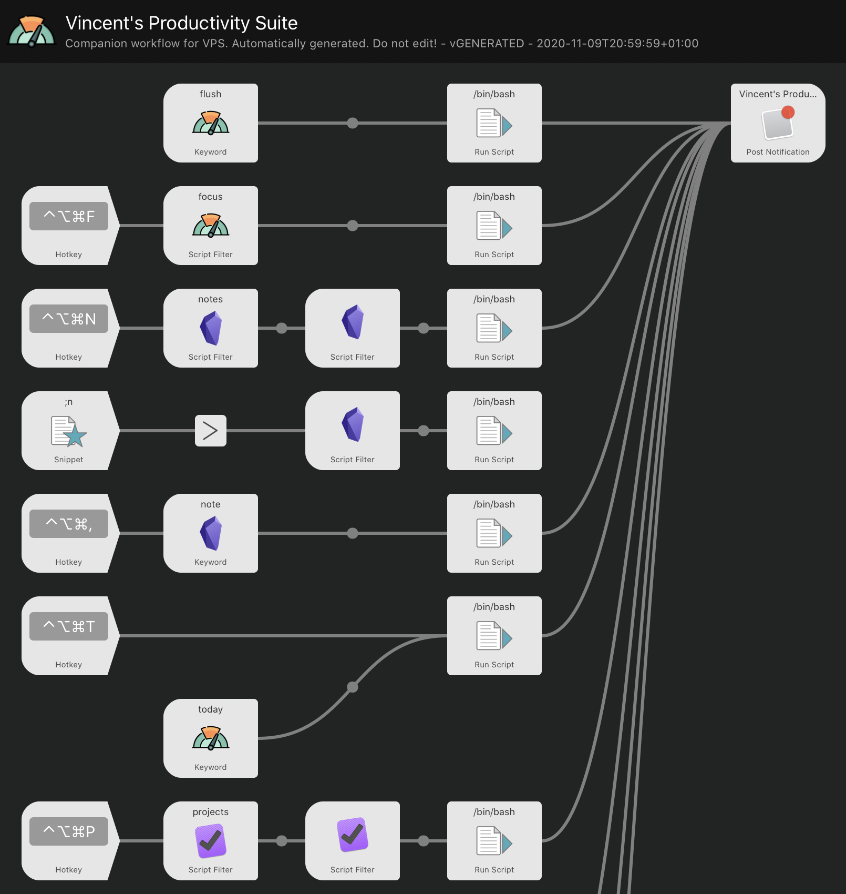

# Vincent's Productivity Suite (for Alfred)

## Beware!

This project isn't called "*Vincent's* Productivity Suite for Alfred" for nothing. It might not be of any use to anyone but myself. But there's also no reason not to make it public; it could be useful to at least one other person beside me. So why not share?

But please remember that I've had exactly one person in mind while creating this suite: me. *Your mileage may vary!*

**A note on the code**: I'm not particularly proud of the code in this project. True Rubyists probably will avert their eyes in disgust. Unit tests are also seriously lacking. But hey, I've been running this tool for several years now day in day out, and it gets the job done!

## So, what's this all about?

This is a command-line interface (CLI) as well as an [Alfred](https://www.alfredapp.com) workflow on top of a set of Ruby scripts that make my daily computer work a lot more efficient. So, yes it's macOS only, and specifically it works with:

- Alfred (duh!)
- Apple Contacts
- Apple Mail
- Apple Calendar
- Bear
- BitBar / SwiftBar
- Desktop wallpapers
- GeekTool
- iA Writer
- Markdown editors
- Marked 2
- Obsidian
- OmniFocus
- Outlook Calendar
- Teams

A lot of activity at my computer consists of managing projects and tasks in OmniFocus, editing notes in Obsidian, managing files in Finder, writing e-mails in Mail and tracking people and groups in Contacts. This CLI and the workflow on top of it give me the means to quickly edit notes and write e-mails and refer to projects and people, either through the terminal, keyboard shortcuts, keywords, or snippets.

An important aspect of this tool is that it works with *areas of responsibility* (a [Getting Things Done (GTD)](https://gettingthingsdone.com) term), like work, family, sports, and software projects (like this one). In VPS you configure all of these areas independently. Then you set the focus to a specific one. At any time, exactly one area has focus. The CLI commands and the keyboard hotkeys, keywords and snippets for Alfred are tuned to the area that has focus. For example, Alfred will only list projects, notes, contacts, events and so on in the area that has focus.

To give you an idea of what the CLI and Alfred workflow can do, here is the output of `vps help` on my own configuration, for the area with the most extensive configuration (work):

```
Usage: vps [options] <type> <command> [arguments]
    -a, --[no-]alfred                Generate output in Alfred format
    -f, --focus [AREA]               Force the focus to the specified area temporarily
    -v, --version                    Show the version number and exit

To get information on all available plugins: vps help

Where <type> and <command> are one of:

  area
    commands  : List all available commands for entities of the specified type in this area
    current   : Prints the name of the area that has focus
    flush     : Flushes any caches for all plugins in this area
    focus     : Set the focus to the specified area
    list      : List all available areas
  contact
    files     : Browse contact files
    finder    : Open contact folder in Finder
    focus     : Focus on this contact
    list      : List all available contacts in this area
    mail      : Write an e-mail
    note      : Edit this contact's note
    notes     : Search notes for this contact
    open      : Open in Contacts
    paste     : Paste contact to the frontmost app
  event
    focus     : Focus on this event
    join      : Join Teams meeting
    list      : List all events for today in this area
    markdown  : Paste event as Markdown to the frontmost app
    note      : Edit this event's note
    notes     : Search notes for this event
    paste     : Paste event to the frontmost app
    paste-attendees: Paste event attendees to the frontmost app
  file
    documents : Browse documents in Alfred
    reference : Browse reference material in Alfred
  group
    list      : List all available groups in this area
    mail      : Write an e-mail
    paste     : Paste group to the frontmost app
  note
    create    : Create a new, empty note, optionally with a title
    index     : Create the index of all notes in this area
    list      : List all notes in this area
    open      : Open in Obsidian
    paste     : Paste note to the frontmost app
    root      : Return the root path on disk to the notes
    today     : Create or open today's note
    view      : Open in Marked
  project
    files     : Browse project files
    finder    : Open project folder in Finder
    focus     : Focus on this project
    list      : List all available projects in this area
    markdown  : Paste project as Markdown to the frontmost app
    note      : Edit this project's note
    notes     : Search notes for this project
    open      : Open in OmniFocus
    paste     : Paste project to the frontmost app

  help <type> <command>: show help on a specific command

Note that the types and commands available depend on the focused area.
```

The accompanying Alfred workflow looks like this (at least, a tiny portion of it; the complete one has 19 rows...):



What you see here is that the CLI and workflow act on *entities*, like projects, contacts, files and notes. Under the hood, VPS triggers macOS applications according to the configuration. For notes, for example, you can use either Obsidian, Bear or iA Writer. The CLI commands, hotkeys and keywords are always the same. You remember the hotkey for creating a new note once, and it will continue to work, even if you switch from one application to another!

How it works: whenever you change the focus, a new Alfred workflow is generated on the fly for the selected area, based on the configuration. The result: same hotkeys, different functionality.

## Installation

### Command-line

1. Clone this repository: `git clone https://github.com/voostindie/vincents-productivity-suite-for-alfred.git`
2. Go to the project root: `cd vincents-productivity-suite-for-alfred`
3. Install all required libraries: `bundle install`

**Important**: if you use macOS's system Ruby, you will need to use `sudo` for the last command! 

After all this, an `exe/vps help` should work. For easier use on the command-line you might want to add the `exe` directory to your `PATH`.

### Alfred

Just change focus once, through the CLI. Every time you change the focus the Alfred workflow is rebuilt, specifically for the area you've selected. This includes registering the workflow in Alfred. (The very first time you might have to restart Alfred.)

### About Ruby versions

I'm taking care that this plugin works with the Ruby version that comes with the latest macOS. At the moment that's `2.6.3`. But I actually use the latest version of Ruby myself. To manage multiple Ruby versions I use [rbenv](https://github.com/rbenv/rbenv) as provided by [Homebrew](https://brew.sh).

The Alfred workflow by default uses the same version of Ruby as the command-line does, but you can override it in the Alfred plugin. See below.

I haven't yet found a way to make the BitBar plugin use the same version. it always uses the system Ruby. But I'm making sure that also works.

## Alfred features

### Keywords and hotkeys

- `focus` / *ctrl* + *opt* + *cmd* + A: sets the focus to an area of responsibility.
- `flush`: flushes all caches for the focused area of responsibility.
- `note` / *ctrl* + *opt* + *cmd* + ,: creates a new note and opens it for editing in after you specify the title.
- `notes` / *ctrl* + *opt* + *cmd* + N: selects a note and shows an action list
- `today` / *ctrl* + *opt* + *cmd* + T: open today's note
- `contact` / *ctrl* + *opt* + *cmd* + C: selects a person from Contacts and shows an action list.
- `project` / *ctrl* + *opt* + *cmd* + P: selects a project from OmniFocus and shows an action list.
- `docs` / *ctrl* + *opt* + *cmd* + D: browses the Documents for the selected area in Alfred's file browser.
- `refs` / *ctrl* + *opt* + *cmd* + R: browses the Reference Material for the selected area in Alfred's file browser.

The list of actions available for a contact or project depends on the configuration of the focused area of responsibility. E.g. if iA Writer is enabled, the action to create a note on a contact, project or event will
automatically show up. 

### Snippets

Using the shared prefix `;` and no suffix for snippets:

- `;c`: copies a contact's name into the frontmost application.
- `;e`: copies an event's name into the frontmost application.
- `;p`: copies a project's name into the frontmost application.
- `;g`: copies all contacts from a contact group into the frontmost application
- `;n`: copies a note's ID into the frontmost application as a Wiki-link

## How to configure

Create a file `.vps/config.yaml` that looks something like this:

```yaml
areas:
   work:
        obsidian:
        omnifocus:
        contacts:
        calendar:
        alfred:
```

This sets up a single *area of responsibility* with the Obsidian, OmniFocus, Contacts, Calendar and Alfred plugins enabled. These plugins all have default configurations, which is why you don't see anything here.

Once the configuration file exists, use `vps area focus` command in the Terminal, or the `focus` keyword (or ⌃⌥⌘-F) in Alfred to focus on a specific area.

## How to configure, in detail

The minimal configuration sample above means exactly the same as:

```yaml
areas:
    work:
        name: 'Work'
        root: '~/Work'
        obsidian:
            vault: 'Work'
            path: 'Notes'
        omnifocus:
            folder: 'Work'
        contacts:
            group: 'Work'
            prefix: 'Work -'
            cache: false
        calendar:
            name: 'Work'
        alfred:
            documents: 'Documents'
            reference material: '.'
        bitbar:
            label: 'Work'
actions:
    alfred:
```

Again, this is the exact same configuration as the one mentioned earlier. From this full example, you probably get the gist. Below there's detailed information on every separate plugin.

To define an additional area, just add one at the same level as 'work'. Name it however you like. To disable a certain feature for an area, remove its reference completely. E.g. if you remove the `obsidian` section and don't add one for another notes app, creating notes is not possible in that area. Alternatively you can select a different plugin that supports the same entities, to have the same shortcuts magically use a different application when you switch focus!

### Areas

An area looks as follow:

```yaml
key:
    name:
    root:
    <plugin>:
```

Where:

- `key`: the technical key. It doesn't really matter what it is, except that the name is derived from it, and that you'll have to use it in CLI when switching focus.
- `name`: the name of the area as shown in Alfred, and as used by the other features as default values. The default value is the `key`, capitalized.
- `root`: the directory under which all files for this area reside on disk. The default is set to `~/<name>`.
- `<plugin>`: the name of the plugin you want to enable, followed by its configuration (if any). Enable as many plugins as needed!

### Obsidian (and note applications in general!)

Since October 2020 I'm using Obsidian for note keeping. It's my current editor of choice. It uses Markdown files on disk. I prefer that over having all my notes - thousands of them, collected over many years - hidden in some database.

The Obsidian plugin supports creating notes from scratch or from existing entities (contacts, events, projects) using *templates*. This templating system is explained here, but it **also applies to the other note keeping applications: iA Writer and Bear**. It works across all apps!

Overall instructions on the usage of Obsidian are:

```yaml
obsidian:
    vault:
    path:
    frontmatter:
    templates:
        default:
            filename: null
            title: '{{input}}'
            text: ''
            tags: []
```

With:

- `vault`: the name (or ID) of the Vault in Obsidian. This defaults to the area name.
- `path`: the root of the notes on disk, defaults to the root of the area followed by `Notes`. Tip: check the output of `vps note root` to test!
- `templates`: these are explained below, in a separate section.
- `frontmatter`: whether tags should be written to the note as YAML frontmatter or not, in which case they are added at the bottom of the file, prepended with a `#`. Defaults to `false`.

#### A note on IDs

This plugin works by assuming that the filename of each note, excluding its extension, is unique. That means that you can move notes around in subdirectories (for example to an archive folder) without breaking anything. 

What's there to break? Two things:

1. Note selections. If you do a `vps note list` you'll get all note IDs.
2. Note links. Pressing `;n` allows you to put a link to a note anywhere. This link is not actually a link, but just plaintext: `[[Like This]]`.

This is, by the way, fully compatible with how Obsidian works.

#### A note on indexing

The Obsidian plugin (and also the iA Writer plugin) offer a command called `index`. This command goes through all notes in the area, creates an index and stores it in a JSON file in the root of the notes directory. The file is called `index.json`.

If this index is present, other note commands, like `open` and `list` use it *instead* of going through all notes on disk themselves. Not only does this improve the performance of these commands, it also improves their functionality: the index also stores pages under their *aliases*, if they have any.

Say you have a note called `Home.md`, containing this front matter:

```yaml
---
aliases: [Start, Index]
---
```

Using the index, the same note can be found under three different names: `Home`, `Start` and `Index`.

A downside of the index is that it isn't automatically updated. You'll need to run the `note index` command for every area that uses it every once in a while. What works for me is scheduling it early each morning.

#### Templates

The note templating support in VPS allows you to set up templates for different types of entities, and for all parts of a note separately. Every individual property you can configure is actually a [Liquid template](https://shopify.github.io/liquid/).

Each note has a filename, a title, a text and a set of tags. The defaults are shown in the configuration of Obsidian above. 

You can:

- Change the defaults that apply to each type of note.
- Change settings for a specific type of note. 

The available note types are 

- `default`: for the settings that apply everywhere
- `plain`: for the basic `note create` command
- `today`: for "Today's note"
- `contact`: for notes based on a contact
- `event`: for notes based on an event
- `project`: for notes based on a project

Here's an example to give you a better idea:

```yaml
iawriter:
    templates:
        default:
            filename: '{{year}}-{{month}}-{{day}} {{input}}'
            title: '{{input}} {{day}}-{{month}}-{{year}}'
            tags:
                - 'todo'
        today:
            filename: '{{year}}-{{month}}-{{day}}'
            tags:
                - 'log'
                - 'todo'
        event:
            text: |
                ## Attendees
                
                - {{name}}
                
```

This sets up the defaults to prepend the current date to every note filename in YYYY-MM-DD format, append it to the title in DD-MM-YYYY format and also add a "todo" tag. Since these are the defaults, this happens for every note type. But, for events, the text is set to a template that fills in the attendees of the event (pulled from the calendar).

The default template for the filename - if you don't configure anything - is `null` (in YAML). In that case VPS uses the template for the title instead. This saves you the trouble of having to define the same thing twice if you want filename and title to be the same.

The variables available to each template depend on the type of note you're configuring:

##### Every note type

- `day`: the number of the day in the current month, zero-padded
- `month`: the number of the current month
- `year`: the current year
- `week`: the number of the week in the current month, zero padded
- `query`: the arguments passed to the command as a string, separated by a space
- `input`: same as query

You can see here that the arguments are passed both in `query` and in `input`. That's on purpose. `input` is meant to be overridden by different note types so that the default template (`{{input}}`) is always sensible. Yet the original arguments are then still available if you need them, in `query`.

##### Plain

- `input`: the input text specified by the user

##### Contact

- `input`: the name of the contact
- `name`: the name of the contact

##### Event

- `input`: the title of the event
- `title`: the title of the event
- `names`: an array of contact names

##### Project

- `id`: the ID of the project in the project repository
- `url`: the URL of the project
- `input`: the name of the project
- `name`: the name of the project

For projects managed in OmniFocus (see later) there's a special add-on: you can override the templates for the title, the text and the tags, *per project*. You do that by adding a "Yaml Back Matter" section at the end of the note of the project, like so:

```yaml
---
<plugin>:
    title: YOUR TITLE TEMPLATE
    text: YOUR TEXT HERE
    tags: YOUR TAGS HERE
```

Just to be sure: put this at the **bottom** of the note, not at the top!

You can have configurations for different plugins next to each other; VPS will pick the right one.

##### Today

- `input`: empty; there is no input text

Tip: Obsidian has a nice *Daily notes* plugin that works nicely with the `vps note today` command. Note that VPS's templates are more powerful than those from Obsidian. Also, you can trigger it from any application using Alfred's global shortcut, not just from within Obsidian. By setting the filename template to `{{year}}-{{month}}-{{day}}` compatibility is guaranteed.

#### Search

The Obsidian plugin also supports searching for projects, events and contacts. Given one of these, VPS can open the search results in Obsidian for it.

This works automatically and requires no additional configuration. However for (OmniFocus) project you can tweak the query by configuring it in the YAML Back Matter of the project, like so:

```yaml
obsidian:
    query: "SEARCH STRING"
```

### iA Writer

Between April 2020 and October 2020 I've used iA Writer for all my note keeping, going back to trusty old Markdown on disk, after using Bear for a little under a year. 

The configuration values for iA Writer are:

```yaml
iawriter:
    location:
    path:
    frontmatter:
```

With:

- `location`: the location in iA Writer for this area, defaults to the name of the area.
- `path`: the root of the notes on disk, defaults to the root of the area followed by `Notes`.
- `frontmatter`: whether tags should be written to the note as YAML frontmatter or not, in which case they are added at the bottom of the file, prepended with a `#`. Defaults to `false`. Note that this is mostly for interoperability with other apps. iA Writer itself does **not** recognize tags configured in the frontmatter!

This is the same as just:

```yaml
iawriter:
```

**And of course you can add a `templates` section!** See the Obsidian plugin for information on how that works.

### Bear

I've used Bear for a little under a year, and stopped using it in August 2020. I went back to sticking my notes in Markdown files on disk. I found that to be more flexible in the end. This plugin is still supported however!!

The configuration values for Bear are:

```yaml
bear:
    token:
```

With:

- `token`: the authentication token required by Bear to control it using URL Commands. To get your token, switch to Bear, select the Help menu and, in there, the API Token section.

**And of course you can add a `templates` section!** See the Obsidian plugin for information on how that works.

### OmniFocus

I use OmniFocus to keep track of all projects and tasks in my life. As most OmniFocus users will have done, I've created top-level folders in the project tree, one for each area of responsibility. This is why the configuration looks like this:

```yaml
omnifocus:
    folder:
```

Where `folder` is the name of the folder to get projects from. It defaults to the name of the area.

In my work folder, where I have the biggest list of projects, I have created several subfolders. That doesn't matter for this workflow, because it gets all projects from all subfolders.

Projects are sorted in the order they appear in OmniFocus, but thanks to Alfred's smart filtering the more you use a project, the higher it will get on the list.

This plugin supports "YAML Back Matter" configuration: if an OmniFocus project *ends* with a piece of YAML, its content is available to every command that works with projects. These commands in turn can use this to their benefit. See the Obsidian (and iA Writer and Bear) note plugins for example, as well as the Alfred plugin.

The YAML Back Matter applies specifically to OmniFocus, but it should be fairly easy to port to other task management applications.

### Alfred

I store all the files for an area under a single directory on disk.
By enabling the Alfred plugin I can browse this directory, and specific subdirectories, through a global shortcut, or quickly open them in the Finder.

The Alfred plugin also add commands to projects and contacts for browsing their files, or opening them in the Finder.

The configuration looks as follows:

```yaml
alfred:
    path:
    documents:
    projects:
    contacts:
```

With:

* `path` (optional): the subdirectory under the area's root directory where files are stored. Defaults to `.`.
* `documents` (optional): the subdirectory under the `path` where documents are stored. Defaults to `Documents`.
* `projects` (optional): the subdirectory under the `path` material directory where project files are kept. Defaults to `Projects`.
* `contacts` (optional): the subdirectory under the `path` material directory where contacts are kept. Defaults to `Contacts`.

But wait, there's more:

#### Project Files

In case of OmniFocus you can have a different project directory specified in the note of the project, in the "YAML Back Matter", for example:

```yaml
---
alfred:
    folder: "Projects/My Project"
```

This will make Alfred browse the "Projects/My Project" directory, no matter the name of the project.

### Apple Contacts

For me, the default Contacts app from Apple, although buggy, is good enough to manage all my contacts. For that to work across my areas of responsibility, I have set up several groups. (You can create and edit groups only on macOS, not on iOS, but once you have them, you can see and use them on all your devices!)

This plugin supports contacts as well as groups of contacts. 

The configuration for Contacts looks as follows:

```yaml
contacts:
    group:
    prefix:
    cache:
```

With:

- `group`: the name of the Contacts group to show contacts from. This defaults to the name of the area.
- `prefix`: the prefix of all names of the groups in this area. This defaults to the value of the `group` setting followed by "` - `"
- `cache`: whether caching of contacts is enabled or not. To prevent surprises this defaults to `false`

Contacts are sorted by name. But thanks to Alfred, the more you use a name, the higher it will get in the result list.

When groups are large, fetching their contacts can take some time. To speed up VPS, you can enable the cache. This stores output on disk, speeding up consecutive runs. The cache is pretty dumb; it doesn't automatically refresh in any way. To flush the cache, run `vps area flush`, which deletes all existing caches for the active area. Since I don't add or delete contacts that much, this is good enough for me.

### Apple Mail

The mail plugin adds a command to Contact and Group entities, by allowing you to send e-mails to them.

The configuration looks as follows:

```yaml
mail:
    from:
```

With:

- `from`: in case you have several accounts configured in Mail, here you can configure which one to use for the area. The format of this field is `Name <address>`. Both the name of the address must match *exactly* what's configured in Mail. If the account is not found, Mail will fall back to its default.

So, how do you quickly send a mail to a bunch of people? Stick them in a group, select the group in Alfred, select "Write an e-mail", and watch the magic happen ;-)

### Apple Calendar

This plugin uses SQL to fetch data from the the Apple Calendar cache, and is definitely not perfect. It doesn't always find all events for the day, even though it does a nice of job of combining one-time events and recurring events. And it's fast.

It also fetches the attendees from the events, and makes them available to other commands.

The configuration looks as follows:

```yaml
calendar:
    name:
    me:
    replacements:
```

With:

- `name`: the name of the calendar to fetch events from.
- `me`: your own name, as it shows up in events. Filling this in ensures that your own name is filtered from the list of attendees for a meeting.
- `replacements`: a list of key-value pairs of people's names, see below.

#### Replacements

Although this plugin does a pretty good job of unmangling people's names from the Calendar, it doesn't always work. On top of that some people are simply published under the wrong name. With the replacements you have the option to fix that. For example:

```yaml
replacements:
    "Bert Simpson": "Bart Simpson"
```

This can save you a lot of repetitive manual work that's easy to forget. 

### Outlook Calendar

**WARNING**: this plugin is limited, in two ways:

1. It's sloooooow. The plugin uses scripting to fetch today's calendar events from Outlook. This takes many seconds, at least in my case.
2. It doesn't find all events for the day. Recurring items that have not been adapted for today are not found.

It's boggling my mind how hard it is to fetch all events that happen on a particular day. I would expect this to be one simple API call away. (This is just as true for Apple's Calendar, by the way.)

Anyway, although hampered, this plugin is still useful I think, because it allows me to create notes for events fairly quickly, including a list of all attendees. That saves me a lot of typing.

The configuration looks as follows:

```yaml
outlookcalendar:
    account: 
    calendar:
    me:
```

Where:

- `account`: the name of the account in Outlook. This defaults to the name of the area.
- `calendar`: the name of the calendar to fetch events from. This defaults to `Calendar`.
- `me`: your e-mail address. This defaults to nothing. Filling this in ensures that your own name is filtered from the list of attendees for a meeting.

### Teams

The Teams plugin allows you to join virtual meetings from the calendar in the Microsoft Teams app. Without a plugin that acts on events enabled in the same area, like the Apple Calendar plugin, this plugin has no use.

The plugin has no configuration of its own, so all you need to do to enable it, is:

```yaml
teams:
```

This adds a `join` command to events, in case the event note contains a link to a Teams meeting. 

### Markdown

The Markdown plugin pulls data from projects and events and pastes it to the frontmost application as Markdown. That Markdown looks as follows:

```
## <title>

text
```

Configuration:

```yaml
markdown:
    level:
    link:
```

With:

* `level` (optional): the level of the Markdown heading for the pasted text. It defaults to 2.
* `link` (optional): whether the name of the project and attendees of events should be generated as [[wikilinks]] or not. It defaults to `false`.

In case of using OmniFocus for projects, the title and text for a project can be defined in the YAML Back Matter of the project, defined under the key `markdown`. If there is no YAML Back Matter, the project name is used as the title of the Markdown, and text is omitted. Note that the configuration in OmniFocus are not just strings of characters, but actual Liquid templates. You can use mostly the same variables as for other notes: day, month, year and week.

In case of an event, the text is set to the list of attendees of the event.

### Marked

The Marked plugin adds a single command to notes: `view`, for showing the note in the Marked 2. The configuration couldn't be simpler:

Configuration:

```yaml
marked:
```

There's no point enabling this plugin when you keep your notes in Bear. It won't show up in that case, because there are no files on disk that Marked can open.

### BitBar / SwiftBar

In case you enable the BitBar or SwiftBar action that's triggered when the focus changes (see below), you can override the label that's shown in the menubar. By default it's the name of the area.

The configuration for BitBar looks as follows:

```yaml
bitbar:
    label:
```

With:

- `label`: the text to show in the menubar. (Tip: you can use emoji's as short titles, and you can configure the label in several ways, like setting the font, the size, the color... See the [BitBar Plugin API documentation](https://github.com/matryer/bitbar#plugin-api).)

Note: also if you use SwiftBar, the configuration to use is `bitbar`!

### Focus

The "Focus" plugin executes multiple commands consecutively against a single entity instance. You can use it, for example, to open a project in OmniFocus, the accompanying note in Obsidian, and a Finder window pointing to its reference data, all in one go. Hence the name "focus".

Not only do I find this plugin useful for myself, it's also quite magical to watch it in action!

This plugin supports projects, events and contacts. Supporting other entities is trivial, but I haven't seen the need yet.

The configuration for this plugin looks as follows:

```yaml
focus:
    project: [finder, note, open]
    event: [command1, command2, command3]
    contact: [command1, command2, command3]
```

With:

- `project`: the list of commands to execute on a single project. In this case the `finder`, `note` and `open` commands.
- `event`: the list of commands to execute on a single event. 
- `contact`: the list of commands to execute on a single event.

### Paste

The "Paste" plugin has no configuration and it's automatically enabled for all area's. What it does is provide a command named `paste` to various entity types, allowing you to paste it to the frontmost application. That can save you some typing in the long run. It's what makes keyboard shortcuts like `;c` in Alfred work.

For events it adds another command: `paste-attendees`, which pastes the names of all attendees from the selected event, straight from you calendar.

## Performing actions when the focus changes

Apart from the `areas` section, the main configuration also supports an `actions` section, where you can list things that must happen whenever the focus changes. Currently these are available:

1. Rebuilding the Alfred workflow
2. Refreshing the name of the area in BitBar / SwiftBar
3. Changing the desktop wallpaper
4. Changing the focus in OmniFocus
5. Refreshing geeklets from GeekTool

The `alfred` plugin is always enabled, even if it's not in your configuration. You can't disable it.

To enable all actions, add this to your configuration:

```yaml
actions:
    alfred:
    bitbar:
    wallpaper:
    omnifocus:
    geektool:
```

See below for details on configuration of each action.

### Updating the Alfred workflow

As mentioned, the `alfred` action is enabled by default. The only reason to explicitly configure it is to override some of its settings:

```yaml
alfred:
    ruby: /path/to/ruby
    notifications: false
```

Where

- `ruby`: the path to the Ruby executable to use from Alfred; see below.
- `notifications`: whether the Alfred actions from VPS should trigger macOS notifications; defaults to `true`.

#### Configuring Ruby

When running VPS without a specific configuration, VPS configures the Alfred workflow with the Ruby that was used to call VPS itself. This works
most of the time, but can lead to surprises in some cases, for example when using rbenv and replacing the current Ruby.

When running VPS under rbenv, the Ruby version is set to something like
`/Users/vincent/.rbenv/versions/2.7.2/bin/ruby`. This works until I replace Ruby 2.7.2 with a newer version. Then all of a sudden the Alfred workflow is broken.

The solution:

```yaml
alfred:
    ruby: ~/.rbenv/shims/ruby
```

This ensures that the Alfred workflow always uses the global default, whatever it is.

### Refreshing the name of the area in BitBar / SwiftBar

[BitBar](https://getbitbar.com) is a nice utility that can show all kinds of texts in the menubar. I use it to show the name of the focused area, so that I always know for sure which area I'm working in. (That's getting more and more important, with any new plugin this tool gets.)

To enable this plugin, first:

- Install BitBar
- Symlink (!) to the `bitbar/focused-area.1d.rb` script from your BitBar plugins folder. **Do not copy the script, otherwise it won't work! Really do make a symlink!**

With this done, BitBar will already show the name of the focused area. But, you'll also want it to update itself whenever you change the focus. One way is polling, but I think that's silly for this use case (which is why the script ends with "1d", meaning: "refresh only once each day"). Instead, this suite can explicitly tell BitBar to refresh the name. To do that, add BitBar to the `actions` configuration, like:

```yaml
bitbar:
    plugin:
```

With:

- `plugin` (optional): the exact name of the plugin. You only need to set this if you changed the name of the symlink.

To override what BitBar shows in the menubar for the focused, see the BitBar configuration on area level, described above.

[SwiftBar](https://swiftbar.app) is a newer alternative to BitBar, that aims to be fully compatible. The BitBar plugin bundled with VPS works with SwiftBar as well.

In case you use SwiftBar, follow the instructions above replacing "BitBar" with "SwiftBar". Only the configuration is slightly different:

```yaml
swiftbar:
    plugin:
```

Here the (optional) `plugin` refers to the name of the VPS plugin *without any extensions*!.

What I personally like about SwiftBar is that it can hide the default built-in menu options, all 5 of them, resulting in a much cleaner application interface. The VPS plugin does exactly that when running under SwiftBar.

### Change the desktop wallpaper

To be able to see which area has the focus, it's possible to have the wallpaper on the current desktop change when changing the focus.

To enable this action, put it in the `actions` configuration, like:

```yaml
wallpaper:
    default:
```

With:

- `default` (optional): the path to the default picture to select when no specific picture is configured for an area. If you don't specify this value, you get the built-in High Sierra wallpaper.

This only enables the action. To make it do anything useful, you'll also want to configure a different wallpaper per area. You do that by adding a `wallpaper` section in each area, like so:

```yaml
wallpaper:
    path:
```

With:

- `path`: the path to the picture to use as desktop wallpaper. If not specified, the default will be used (see above).

Unfortunately this plugin works only on the desktop (space) that's currently being shown. If you have multiple desktops, you'll probably end up with different wallpapers. I haven't yet found a way to fix this.

## Change the focus in OmniFocus

To set the focus to the group configured for the active area, simply add an action for OmniFocus:

```yaml
omnifocus:
```

That's it. The section has no default settings as of yet.

What this action does is pick the very first OmniFocus window it can find, and change its focus. For me this is just fine, since I always have exactly one OmniFocus window open anyway.

### Show the focused area in GeekTool

Lately I've been experimenting a bit with my desktop setup. Currently I use just one desktop and have set the menubar and Dock to hide automatically. That means I don't get to see the active area all the time with BitBar. Solution: [GeekTool](https://www.tynsoe.org/v2/geektool/). I've set up a couple of *geeklets* that show up at the bottom of my screen and that are hardly ever covered by windows: the currently playing track, a clock, and the name of the active area.

The geeklet to show the active area simply calls `vps area current`, which outputs the name of the focused area. On top of that VPS offers a plugin to tell GeekTool to refresh certain geeklets whenever the focus changes. To enable that plugin, add GeekTool to the `actions` configuration:

```yaml
geektool:
    geeklets:
```

The geeklets property expects a list of geeklet *names* to refresh. Setting a name is optional in GeekTool, but for this plugin to work you'll have to configure them. (The alternative is to use IDs. But these are long, random and can't easily be copied.)

## About the icon

The icon used by VPS is made by [Freepik](http://www.freepik.com) from [Flaticon](https://www.flaticon.com) and is licensed by a [Creative Commons BY 3.0](http://creativecommons.org/licenses/by/3.0).
